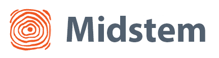

<h1 align='center'>Chronous</h1>


<a href='https://midstem.net'>
  
</a>

<p><b>Chronous</b> is a versatile npm package, offering a customizable and feature-rich calendar solution adaptable for both desktop and mobile platforms. With Chronous, users can easily modify and tailor the calendar to suit their specific needs, enabling seamless integration into various web applications.</p>

<h3>Installation</h3>

<b>npm</b>

```bash
$ npm install chronous
```

<b>yarn</b>

```bash
$ yarn add chronous
```

</br>

<h2><b>Usage</b></h2>

```jsx
import { useState } from 'react'
import Chronous from 'chronous'
import ModalWindow from 'src/features/ModalWindow'
import { EventT } from 'src/types'
import ChevronRight from 'src/assets/icons/chevron-right.svg'
import ChevronLeft from 'src/assets/icons/chevron-left.svg'
import ChevronDown from 'src/assets/icons/chevron-down.svg'

export const App = () => {
  const [events, setEvents] = useState<EventT[]>([])

  return (
    <Chronous
      events={events}
      view="Week"
      config={[{ minWidth: 450, mode: 'desktop' }]}
      nextButton={<ChevronRight />}
      prevButton={<ChevronLeft />}
      dropDownArrow={<ChevronDown />}
      eventModal={({ onClose, ...event }) => (
        <ModalWindow
          onClose={onClose}
          id={event.id}
          events={events}
          selectedEvent={event}
          setEvents={setEvents}
        />
      )}
      newEventModal={({ onClose, time, day }) => (
        <ModalWindow
          day={day}
          time={time}
          events={events}
          onClose={onClose}
          setEvents={setEvents}
        />
      )}
    />
  )
}

```

</br>

<h2>🔥 <a href='https://chronous.midstem.net'>Play around with Chronous</a></h2>

</br>

<h2><b>Browsers support</b></h2>

| [](http://godban.github.io/browsers-support-badges/)<br/>IE / Edge | [](http://godban.github.io/browsers-support-badges/)<br/>Firefox | [](http://godban.github.io/browsers-support-badges/)<br/>Chrome | [](http://godban.github.io/browsers-support-badges/)<br/>Safari 
| --------- | --------- | --------- | --------- |
| IE11, Edge| last 3 versions| last 3 versions| last 3 versions

</br>

<h2><b>Props</b></h2>

<table width='100%'>
  <tr>
    <th><h3><b>Props</b></h3></th>
    <th><h3><b>Description</b></h3></th>
    <th><h3><b>Default</b></h3></th>
    <th><h3><b>Type</b></h3></th>
  </tr>
  <tr>
    <td>events</td>
    <td>List of events to be displayed on the calendar</td>
    <td>There are default events that will be gone as soon as you pass a property <code>events</code></td>
    <td>{id: string; title: string; start: string; end: string; overlapping?: number; color?: string; textColor?: string; opacity?: number}[]</td>
  </tr>
  <tr>
    <td>view</td>
    <td>Specifies calendar view</td>
    <td><code>'Week'</code></td>
    <td>"Day" | "Week" | "Month"</td>
  </tr>
  <tr>
    <td>mode</td>
    <td>Specifies calendar mode</td>
    <td><code>'desktop'</code></td>
    <td>"mobile" | "desktop"</td>
  </tr>
  <tr>
    <td>selectedEvent</td>
    <td>Returns a selected event id</td>
    <td>-</td>
    <td>string</td>
  </tr>
  <tr>
    <td>startHour</td>
    <td>Sets starting day hour</td>
    <td><code>0</code></td>
    <td>number</td>
  </tr>
  <tr>
    <td>endHour</td>
    <td>Sets ending day hour</td>
    <td><code>24</code></td>
    <td>number</td>
  </tr>
  <tr>
    <td>currentDay</td>
    <td>Specifies current day</td>
    <td><code>new Date()</code></td>
    <td>string | Date</td>
  </tr>
  <tr>
    <td>nextButton</td>
    <td>Sets a custom arrow that gets you to the next day/week/month</td>
    <td><code>&lt;RightArrow /&gt;</code></td>
    <td>ReactNode</td>
  </tr>
  <tr>
    <td>prevButton</td>
    <td>Sets a custom arrow that gets you to the previous day/week/month</td>
    <td><code>&lt;LeftArrow /&gt;</code></td>
    <td>ReactNode</td>
  </tr>
  <tr>
    <td>dropdownArrow</td>
    <td>Prop for custom dropdown arrow</td>
    <td><code>&lt;ChevronDown /&gt;</code></td>
    <td>ReactNode</td>
  </tr>
  <tr>
    <td>customEventComponent</td>
    <td>Sets a custom eventComponent</td>
    <td><EventComponent /></td>
    <td>ReactNode</td>
  </tr>
  <tr>
    <td>eventModal</td>
    <td>Sets a custom event modal that will be open when a user clicks on existing event</td>
    <td>-</td>
    <td>eventModal: ((a: {onClose: () => void, id: string, title: string, start: string, end: string, overlapping: number, color: string, textColor: string, }) => React.ReactNode)</td>
  </tr>
   <tr>
    <td>newEventModal</td>
    <td>Sets a custom event modal that will be open when a user clicks on an empty cell to create new event</td>
    <td>-</td>
    <td>newEventModal: ((a: {onClose: () => void, day: Date, time: string }) => React.ReactNode)</td>
  </tr>
  <tr>
    <td>onCellClick</td>
    <td>Allows a user to pass a custom functionality and modal window that will be triggered on cell click</td>
    <td>-</td>
    <td>onCellClick: (a: {day: Date, time: string}) => void</td>
  </tr>
  <tr>
    <td>onEventClick</td>
    <td>Allows a user to pass a custom functionality and modal window that will be triggered on an event click </td>
    <td>-</td>
    <td>onEventClick: (a: {id: string, title: string, start: string, end: string, overlapping: number, color: string, textColor: string, }) => void</td>
  </tr>
  <tr>
    <td>onViewChange</td>
    <td>Returns a chosen view on view change</td>
    <td>-</td>
    <td>onViewChange: (view: "Day" | "Week" | "Month") => void</td>
  </tr>
  <tr>
    <td>onDateChange</td>
    <td>Returns start and end date on date change</td>
    <td>-</td>
    <td>(start: Date, end: Date) => void</td>
  </tr>
  <tr>
    <td>config</td>
    <td>Takes an array of objects to manipulate view: <code>minWidth, mode</code></td>
    <td>-</td>
    <td>{minWidth: number, mode: "Day" | "Week" | "Month"}[]</td>
  </tr>
  <tr>
    <td colspan='4' align='center'><h3><code>config</code> parameters:</h3></td>
  </tr>
  <tr>
    <td>minWidth</td>
    <td>Defines a width after which the mode will change</td>
    <td>-</td>
    <td>number</td>
  </tr>
  <tr>
    <td>mode</td>
    <td>Specifies calendar mode</td>
    <td><code>'desktop'</code></td>
    <td>"mobile" | "desktop"</td>
  </tr>
</table>
